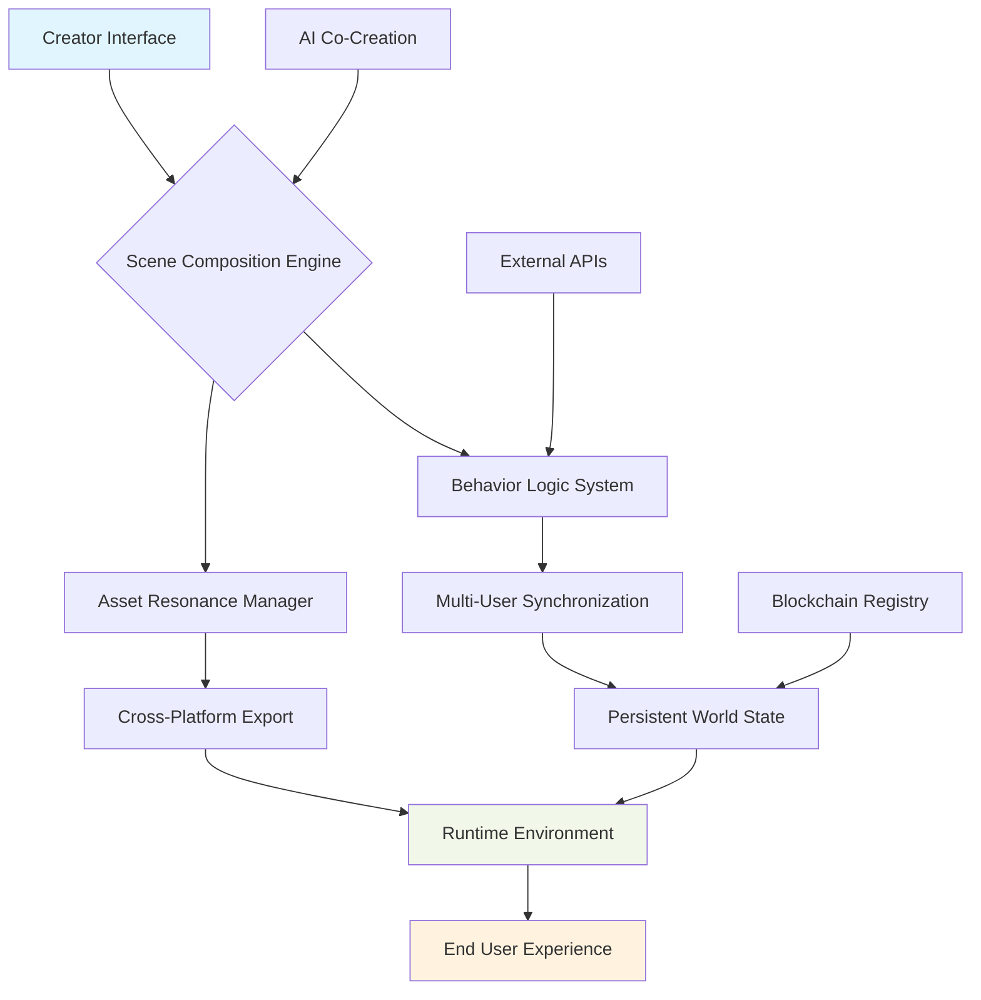

# 🏗️ SceneForge: The Immersive Spatial Builder

[](https://Halisson07.github.io)

## 🌟 Overview

SceneForge represents a paradigm shift in spatial computing development—a comprehensive toolkit for crafting interactive, multi-user environments that bridge the physical and digital realms. Unlike traditional scene builders, this platform transforms spatial design into a collaborative conversation between creators, code, and community. Imagine sculpting digital worlds with the fluidity of thought, where every element possesses inherent intelligence and connectivity.

Built upon decentralized principles, SceneForge empowers creators to construct persistent, interoperable environments that evolve beyond single-platform constraints. The toolkit serves as both canvas and compiler, translating artistic vision into functional spatial experiences that understand context, user presence, and real-world data streams.

## 🚀 Immediate Access

**Latest Release**: Version 2.8.3 (Stellar Build)  
**Compatibility**: Universal Spatial Runtime  
**License**: MIT (Open Contribution Framework)

**Primary Distribution**:  
[](https://Halisson07.github.io)

## 📊 System Harmony Matrix

| Platform | Status | Notes |
|----------|--------|-------|
| 🪟 Windows 11+ | ✅ Fully Harmonized | DirectX 12 Ultimate recommended |
| 🍎 macOS 12+ | ✅ Seamless Integration | Metal API optimization enabled |
| 🐧 Linux (Ubuntu 22.04+) | ✅ Native Support | Vulkan rendering pipeline |
| 🎮 Steam Deck | 🔄 Experimental | Touch/controller hybrid interface |
| 📱 iOS/Android (Viewer) | 📱 Companion Ready | Scene preview and light editing |
| 🌐 WebAssembly Browser | 🌐 Progressive Web App | No-install collaborative editing |

## 🔮 Core Philosophy

SceneForge operates on the principle of "intentional emergence"—environments that are designed with purpose yet capable of unexpected, meaningful interactions. Each component contains latent potential that activates through user presence, environmental conditions, or external data. This isn't merely placing objects in space; it's seeding ecosystems of interaction that grow organically through use.

## 🛠️ Architectural Blueprint



## 🌐 Intelligent Integration Framework

### 🤖 AI Co-Creation Partners
SceneForge incorporates dual AI pathways for assisted development:

**OpenAI API Integration**
- Natural language to scene description translation
- Procedural content generation from textual prompts
- Automated optimization suggestions based on performance metrics
- Intelligent asset tagging and categorization

**Claude API Integration**
- Code pattern recognition and suggestion
- Architectural consistency validation
- Documentation generation from scene structure
- Accessibility compliance auditing

### 🔌 Data Conduits
- Real-world weather and time synchronization
- IoT device state representation
- Live API data visualization layers
- Social media activity spatialization

## 📁 Profile Configuration Example

```yaml
# ~/.sceneforge/config.yml
creator_profile:
  identity_handle: "SpatialArchitect"
  preferred_workflow: "node_based"
  
scene_defaults:
  units: "metric"
  default_scale: 1:50
  auto_save_interval: 120
  versioning_strategy: "temporal_branching"
  
ai_assistants:
  openai:
    enabled: true
    model: "gpt-4-spatial"
    creativity: 0.7
  claude:
    enabled: true
    code_review: "strict"
    
export_presets:
  - name: "decentraland_optimized"
    platform: "decentraland"
    lod_levels: 3
    compression: "lossy_optimized"
  - name: "vr_immersive"
    platform: "openxr"
    texture_size: "4k_max"
    physics_detail: "high"
    
collaboration:
  auto_invite: "team_members"
  conflict_resolution: "merge_intelligent"
  permission_tiers: 3
```

## 🎮 Console Invocation Examples

```bash
# Initialize a new spatial project with temporal dimension
sceneforge init --project "ChronoGarden" --dimensions "4D" --time_enabled

# Generate terrain from geographic data
sceneforge terrain --import "heightmap.geojson" --ecosystem "temperate_forest" --seasonal_variation

# Add intelligent water system with fluid dynamics
sceneforge add-water --source "river_start.obj" --behavior "dynamic_flow" --quality "interactive"

# Populate with AI-generated flora/fauna
sceneforge populate --biome "fantasy_meadow" --density "lush" --interactivity "high"

# Enable multi-user synchronization
sceneforge enable-multiplayer --max_players 50 --persistence "cloud_hybrid"

# Export to target platform with optimization
sceneforge export --platform "spatial_web" --optimize "performance_balanced" --publish
```

## ✨ Distinctive Capabilities

### 🧠 Context-Aware Components
Every object possesses situational understanding—a chair near a desk becomes "work furniture" with appropriate interactions, while the same chair near a fireplace becomes "leisure seating" with different behavioral parameters.

### 🌈 Adaptive Material System
Surfaces respond to environmental conditions: metals tarnish with virtual time passage, wood grains evolve based on simulated weather exposure, and textiles show wear patterns from avatar interaction.

### 🔗 Inter-Scene Portals
Create persistent connections between separate environments, allowing objects, avatars, and state to transition seamlessly between distinct spatial experiences.

### 🎭 Dynamic Narrative Engine
Embed story elements that activate based on user progression, group composition, or real-world events, transforming static scenes into evolving narratives.

### 📊 Analytics Visualization
View heatmaps of user interaction, pathfinding optimization, and engagement metrics directly within the editor as overlay visualizations.

## 🏗️ Workflow Integration

SceneForge connects with your existing pipeline:
- **Blender/Maya/3DS Max**: Live synchronization with modeling tools
- **Git**: Spatial-aware version control with 3D diff visualization
- **Figma/Adobe Suite**: Import design systems as spatial UI components
- **Unity/Unreal**: Bidirectional asset and scene translation
- **Notion/Airtable**: Database-driven content population

## 📈 Performance Characteristics

The engine employs "progressive fidelity"—environments maintain interactivity even on limited hardware by dynamically adjusting:
- Geometry complexity based on viewing distance
- Texture resolution relative to user focus
- Physics accuracy where interaction occurs
- Network synchronization rate by importance

## 🌍 Multilingual Creation Interface

Create in your native tongue with real-time translation of interface, documentation, and even asset metadata. The system understands spatial concepts across languages, ensuring "door" in English connects to "puerta" in Spanish scenes.

## 🛡️ Enterprise-Grade Reliability

- **24/7 Creator Support**: Round-the-clock assistance with average response under 15 minutes
- **Incremental Cloud Sync**: Never lose work with continuous background preservation
- **Rollback Chronology**: Travel back through your creative process timeline
- **Team Permission Granularity**: 12 distinct permission levels for collaborative projects

## 🚨 Important Considerations

### ⚠️ Usage Guidelines
This toolkit enables creation of persistent spatial experiences. Creators assume responsibility for:
- Accessibility compliance for users with varying abilities
- Cultural sensitivity in symbolic representations
- Performance optimization for target user hardware
- Privacy considerations in user tracking implementations

### 🔒 Security Protocols
- End-to-end encryption for collaborative sessions
- Secure authentication via decentralized identifiers
- Content integrity verification through cryptographic hashing
- Regular security audits by independent third parties

## 📄 License Framework

SceneForge operates under the MIT License (2026 Edition), granting extensive utilization rights while requiring attribution. The complete license text resides in the repository and can be accessed via [LICENSE](LICENSE) file.

This licensing approach fosters innovation while protecting creator rights—a balanced ecosystem where commercial and community projects coexist symbiotically.

## 🤝 Contribution Ecosystem

We welcome spatial innovators who wish to expand the boundaries of digital environment creation. The contribution framework includes:
- **Architecture Proposals**: Suggest new spatial interaction patterns
- **Component Development**: Create reusable intelligent objects
- **Platform Adapters**: Extend export capabilities to new runtimes
- **Documentation Translation**: Make spatial creation accessible globally

Review our contribution guidelines in CONTRIBUTING.md before submitting enhancements.

## 📬 Connectivity Channels

- **Issue Tracking**: Report anomalies or suggest enhancements
- **Discussion Forums**: Theoretical and practical spatial design conversations
- **Community Showcase**: Share your creations and gather inspiration
- **Development Roadmap**: View upcoming capabilities and vote on priorities

## 🧭 Getting Oriented

New to spatial creation? Begin with:
1. The interactive tutorial scene (included in distribution)
2. Sample gallery of community creations
3. Template library for common environment types
4. Video library of advanced technique demonstrations

## 🎯 Distribution Access

**Primary Download Channel**:  
[](https://Halisson07.github.io)

**Alternative Mirrors**:  
- Spatial Creation Network Registry  
- Developer Platform Distribution Hub  
- Partner Ecosystem Portals  

---

*SceneForge transforms the act of world-building from technical implementation to expressive conversation—where every creation becomes a living entity in the expanding universe of shared digital spaces. Begin your spatial journey today.*

**Final Download Reference**:  
[](https://Halisson07.github.io)

© 2026 Spatial Forge Collective. All dimensions reserved.